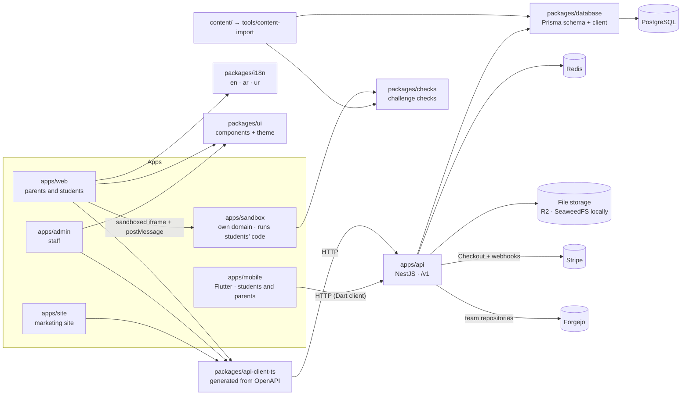

# Kids Coding Platform

Monorepo for the Kids Coding Platform: the NestJS API, the Next.js apps (student and parent web app, admin panel, marketing site), the Flutter app and their shared packages.

Planning documents live one folder up: `kids-coding-platform-scope.md` and `implementation-plan.md`.

## What's here today

Phase 0 (infrastructure) and all of **Phase 1** (web) are done: sign-up, login and permissions (Sprint 1); child accounts, consent and the admin panel (2); lessons, the code editor, the sandbox and auto-checked challenges (3); projects, portfolios, XP, streaks, leaderboards and pilot tools (4, the **M1 pilot slice**); badges, every leaderboard level, seasons and Python (5); plans and payments (6); the marketing site, emails, public portfolios, certificates and notifications (7); and the security review, performance, accessibility, load test, runbooks and admin settings (8, **M2 paid launch**).

**Phase 1b** (the Flutter app for students and parents) and all of **Phase 2** are done too: the content studio and translation workflow (Sprint 1); the mentor console, with certificates after a mentor's approval (2); the Explorer track with blocks on the web (3) and in the app, with accounts for under-13s after parental consent (4); leagues and friends (5); referrals and weekly parent reports (6); moderated team rooms (7); the Pro track's git lessons and hackathons with team repositories (8); and schools, teachers and the hub readiness check (9).

**Phase 3** (the real-world hub) is built, but not open to families yet: Gate 2 (the legal review of hub work, earnings and IP) isn't met. Hub foundations, eligibility and the agreements (Sprint 1); client accounts, the "Hire our students" page and the request queue (2); scoping, quotes and client invoices (3); matching, the team, the hour caps with a timer, reviews and merging (4–5); milestones with built-in previews and the client's acceptance (6); the double-entry ledger, earnings, payout accounts and payouts to parents — through Wise, its mock, or recorded by hand (7); and hub work in portfolios, stories with a parent's yes, demo data and runbooks (8). The hub opens country by country (**Country rules** in the admin panel; every country starts closed) and payouts stay off (the `hub_payouts` feature flag) until the lawyer signs off. See [the hub runbook](docs/runbooks/hub.md) and [payouts](docs/runbooks/hub-payouts.md).

| Path                       | What it is                                                                                                                                                                                                                                                                                                                                                                                                                                                                                                                                                                                                                                                                                                                                                                                                                                                                                                                                                                                                                                                                                                                                                                                                                                                                                                                                                                                                                                                                                                                                      |
| -------------------------- | ----------------------------------------------------------------------------------------------------------------------------------------------------------------------------------------------------------------------------------------------------------------------------------------------------------------------------------------------------------------------------------------------------------------------------------------------------------------------------------------------------------------------------------------------------------------------------------------------------------------------------------------------------------------------------------------------------------------------------------------------------------------------------------------------------------------------------------------------------------------------------------------------------------------------------------------------------------------------------------------------------------------------------------------------------------------------------------------------------------------------------------------------------------------------------------------------------------------------------------------------------------------------------------------------------------------------------------------------------------------------------------------------------------------------------------------------------------------------------------------------------------------------------------------------- |
| `apps/api`                 | NestJS 12 API: parent sign-up with email confirmation, login, password reset, staff two-factor login, child accounts with parental consent, student login, role permissions (CASL), rate limits, audit log, admin endpoints, reference data, health checks, OpenAPI docs; module projects shipped to file storage, portfolios and public portfolio links, XP, levels, daily goal, streaks and streak freezes, badges, leaderboards (world, country, region, city; weekly, season, all time) with seasons, plans and payments (Stripe, or a mock of it in development; manual payments; trials; refunds; invoices), certificates, notifications, emails in three languages (trial reminders, receipts, monthly summaries), the waitlist, account export and deletion, feedback, premium by hand, the five pilot numbers, and admin settings (countries, prices, languages, feature flags, content publishing); Phase 2: the content studio, mentor reviews, parental consent for under-13s, picture passwords and pairing with a parent's phone, leagues and friends, referrals, weekly parent reports, team rooms (socket.io) with moderation, hackathons with team repositories on Forgejo (students reach them through the API's git proxy), schools, classes and licences, and the hub readiness check; Phase 3: the hub — client accounts and requests, projects, quotes and invoices, the team and its timer, milestones with built-in previews, the double-entry ledger, earnings, payout accounts and payouts (Wise or by hand), stories |
| `apps/web`                 | Next.js 16 web app in English, Arabic and Urdu (right-to-left): parent sign-up and login, parent dashboard (add children, sharing switches, new password, delete, lessons done), printable login card, student login, the lesson map and the lesson player (video, explainer, CodeMirror editor with autosave, live preview, "Check my code"), Python lessons (Pyodide), module projects (`index.html`, `style.css`, `script.js`, "Ship it"), portfolio and share links, level, XP bar, daily goal and streak, badges, leaderboards, certificates, notifications, plans and payments with invoices, the parent's account (change password, download data, delete account, accept new terms), the feedback button, and the safety, terms and privacy pages (drafts); Phase 2: the Explorer track (Blockly), leagues, friends, team rooms, hackathons (git in the browser), classes, the readiness check, and areas for mentors (`/mentor`) and teachers (`/teacher`); Phase 3: the hub for students (`/learn/hub`), parents (`/hub`, `/payouts`), lead developers (`/mentor/hub`) and clients (`/client`)                                                                                                                                                                                                                                                                                                                                                                                                                                        |
| `apps/sandbox`             | Runs students' code on its own domain (HTML, CSS, JavaScript and Python): a static page the web app embeds in a sandboxed iframe, with loop guards, time limits, console capture and the checks; also the public portfolio page, and the client's milestone preview (`/preview/`)                                                                                                                                                                                                                                                                                                                                                                                                                                                                                                                                                                                                                                                                                                                                                                                                                                                                                                                                                                                                                                                                                                                                                                                                                                                               |
| `apps/admin`               | Next.js 16 admin panel (English): staff login with two-factor authentication, overview, pilot numbers, users (suspend, reactivate, sign out everywhere, family, premium by hand, certificates), feedback inbox (safety reports first), payments (manual payments, refunds), waitlist, content preview and publishing, countries, prices and languages, feature flags, leaderboards and seasons, parental consent records, audit log; Phase 2: the content studio and translations, mentors, under-13 consent checks, moderation and blocked words, hackathons and schools; Phase 3: the Hub (requests, projects, students, clients, payouts, payout accounts, ledger, stories, country rules)                                                                                                                                                                                                                                                                                                                                                                                                                                                                                                                                                                                                                                                                                                                                                                                                                                                   |
| `apps/mobile`              | Flutter app for students and parents (Android and iOS; en/ar/ur): lessons, quizzes and daily practice, the Explorer blocks (a WebView), streaks, XP and leaderboards, leagues and friends, team rooms, the parent's view with consent switches, and push notifications — see [docs/mobile-release.md](docs/mobile-release.md); parents approve hub projects and see their child's hub earnings                                                                                                                                                                                                                                                                                                                                                                                                                                                                                                                                                                                                                                                                                                                                                                                                                                                                                                                                                                                                                                                                                                                                                  |
| `apps/site`                | Next.js 16 marketing site in English, Arabic and Urdu: home, how it works, tracks, pricing per country, safety, FAQ, about, blog and the waitlist, and "Hire our students" for businesses                                                                                                                                                                                                                                                                                                                                                                                                                                                                                                                                                                                                                                                                                                                                                                                                                                                                                                                                                                                                                                                                                                                                                                                                                                                                                                                                                       |
| `packages/database`        | Prisma 7 schema, migrations, reference data and the permission matrix                                                                                                                                                                                                                                                                                                                                                                                                                                                                                                                                                                                                                                                                                                                                                                                                                                                                                                                                                                                                                                                                                                                                                                                                                                                                                                                                                                                                                                                                           |
| `packages/api-client-ts`   | Typed TypeScript client generated from the API's OpenAPI document                                                                                                                                                                                                                                                                                                                                                                                                                                                                                                                                                                                                                                                                                                                                                                                                                                                                                                                                                                                                                                                                                                                                                                                                                                                                                                                                                                                                                                                                               |
| `packages/api-client-dart` | Dart client for the Flutter app, generated from the same document (only the routes the app uses)                                                                                                                                                                                                                                                                                                                                                                                                                                                                                                                                                                                                                                                                                                                                                                                                                                                                                                                                                                                                                                                                                                                                                                                                                                                                                                                                                                                                                                                |
| `packages/i18n`            | Interface text in every language, with tests that keep the languages in step                                                                                                                                                                                                                                                                                                                                                                                                                                                                                                                                                                                                                                                                                                                                                                                                                                                                                                                                                                                                                                                                                                                                                                                                                                                                                                                                                                                                                                                                    |
| `packages/ui`              | Shared React components (buttons, fields, switches, dialogs, the 12 preset avatars) and the design tokens (`theme.css`)                                                                                                                                                                                                                                                                                                                                                                                                                                                                                                                                                                                                                                                                                                                                                                                                                                                                                                                                                                                                                                                                                                                                                                                                                                                                                                                                                                                                                         |
| `packages/checks`          | The challenge checks (`exists`, `text`, `attribute`, `css`, `test`, `output`), page building and loop guards — shared by the sandbox, the web app, the API (which re-runs the HTML and CSS checks) and the content importer                                                                                                                                                                                                                                                                                                                                                                                                                                                                                                                                                                                                                                                                                                                                                                                                                                                                                                                                                                                                                                                                                                                                                                                                                                                                                                                     |
| `packages/shared`          | Rules the API and the apps share: password lengths, nickname pattern, avatar list, age limits, XP limits, the daily goal, trial length and the terms version                                                                                                                                                                                                                                                                                                                                                                                                                                                                                                                                                                                                                                                                                                                                                                                                                                                                                                                                                                                                                                                                                                                                                                                                                                                                                                                                                                                    |
| `content/`                 | The lessons as files (YAML and Markdown in en/ar/ur): Builder track, Module 1 (a first website: lessons 1–5 and the project) and Module 2 (Python first steps); Explorer track, Module 1 (5 block lessons and the Star catcher game); Pro track, Module 1 (Git and teamwork) — see [content/README.md](content/README.md)                                                                                                                                                                                                                                                                                                                                                                                                                                                                                                                                                                                                                                                                                                                                                                                                                                                                                                                                                                                                                                                                                                                                                                                                                       |
| `tools/content-import`     | Checks the lessons (every solution passes, every starter still fails) and imports them into PostgreSQL                                                                                                                                                                                                                                                                                                                                                                                                                                                                                                                                                                                                                                                                                                                                                                                                                                                                                                                                                                                                                                                                                                                                                                                                                                                                                                                                                                                                                                          |
| `tools/explorer-embed`     | Builds the Explorer blocks and Bit's world into `apps/mobile/assets/explorer` for the app's WebView                                                                                                                                                                                                                                                                                                                                                                                                                                                                                                                                                                                                                                                                                                                                                                                                                                                                                                                                                                                                                                                                                                                                                                                                                                                                                                                                                                                                                                             |
| `tools/load-test`          | The 1,000-student load test — see [docs/load-test.md](docs/load-test.md)                                                                                                                                                                                                                                                                                                                                                                                                                                                                                                                                                                                                                                                                                                                                                                                                                                                                                                                                                                                                                                                                                                                                                                                                                                                                                                                                                                                                                                                                        |
| `infra/storage`            | S3-compatible file storage for local development (SeaweedFS in Docker); Cloudflare R2 in production                                                                                                                                                                                                                                                                                                                                                                                                                                                                                                                                                                                                                                                                                                                                                                                                                                                                                                                                                                                                                                                                                                                                                                                                                                                                                                                                                                                                                                             |
| `docs/`                    | Deployment, [runbooks](docs/runbooks/README.md), the [security review](docs/security-review.md), [performance](docs/performance.md), [accessibility](docs/accessibility.md) and the [load test](docs/load-test.md)                                                                                                                                                                                                                                                                                                                                                                                                                                                                                                                                                                                                                                                                                                                                                                                                                                                                                                                                                                                                                                                                                                                                                                                                                                                                                                                              |
| `docker-compose.yml`       | PostgreSQL 16, Redis 7, Mailpit, the file storage and Forgejo (team repositories) for local development                                                                                                                                                                                                                                                                                                                                                                                                                                                                                                                                                                                                                                                                                                                                                                                                                                                                                                                                                                                                                                                                                                                                                                                                                                                                                                                                                                                                                                         |
| `.github/workflows`        | CI (dependency audit, lint, typecheck, tests, build, browser tests, migration and API-contract checks) and API deploys                                                                                                                                                                                                                                                                                                                                                                                                                                                                                                                                                                                                                                                                                                                                                                                                                                                                                                                                                                                                                                                                                                                                                                                                                                                                                                                                                                                                                          |

Coming next: Gate 2 (the lawyer's review for one pilot country), then the hub pilot with three clients (Gate 3), then Phase 4 (see the implementation plan).

## First-time setup (Windows, macOS or Linux)

You need:

1. **Node.js 24 LTS** — from [nodejs.org](https://nodejs.org), or `nvm install 24`. Older Node versions ship a Corepack that can't run pnpm 12.
2. **pnpm 12** — `npm install --global pnpm@12` (the exact version is pinned in `package.json`).
3. **Docker Desktop** — runs PostgreSQL, Redis, Mailpit and the file storage. On Windows, use the WSL 2 backend.
4. **Git**.

Then, in this folder:

```bash
git init                      # first time only, if this isn't a Git repository yet
cp .env.example .env          # PowerShell: Copy-Item .env.example .env
pnpm install
pnpm bootstrap                # starts services, creates the database, seeds it, builds everything, imports the lessons
pnpm dev                      # API, web app, admin panel and code sandbox with hot reload
```

Open:

- Web app: <http://localhost:3001> — sign up as a parent (the confirmation email lands in Mailpit), add a child (aged 13 or over for now), then log in as the child at **Student log in** and start the first lesson
- Admin panel: <http://localhost:3002> — staff only (see below)
- Marketing site: <http://localhost:3003> — pricing and the waitlist
- Code sandbox: <http://localhost:3004> — a blank page on its own; the lessons embed it
- Email inbox (Mailpit): <http://localhost:8025>
- Card payments: without a Stripe key, a mock of Stripe Checkout opens instead; see [docs/deployment.md](docs/deployment.md#card-payments-stripe) to use Stripe
- File storage: S3 API on <http://localhost:8333>, file browser on <http://localhost:8888/buckets/kcp-files/> (shipped projects are under `projects/`)
- API docs: <http://localhost:3000/docs>
- API health: <http://localhost:3000/v1/health/ready>
- Git server for hackathon team repositories (Forgejo): <http://localhost:3005> — run `pnpm forgejo:setup` once and add the two lines it prints to `.env` (`FORGEJO_URL`, `FORGEJO_TOKEN`), then restart the API. Without them, hackathons run without team repositories.

To use the admin panel, create a staff account, then log in at <http://localhost:3002> with the printed temporary password. The first login asks you to scan a QR code with an authenticator app (Google Authenticator, Microsoft Authenticator, 1Password…).

```bash
pnpm staff:create --email you@example.com --name "Your Name" --role super_admin
```

**Updating from an earlier version?** Compare your `.env` with `.env.example` and copy any lines you're missing (Sprint 1 added the auth secrets and email settings; Sprints 6–7 added `SITE_URL`, `API_PUBLIC_URL` and the optional Stripe keys). Compare each app's `.env.local` with its `.env.example` too. Then run `pnpm install`, `pnpm services:up`, `pnpm db:deploy`, `pnpm db:seed`, `pnpm build` and `pnpm content:import`. After Sprint 8, parents are asked to accept the new terms once, and adult passwords need 12 characters (existing passwords keep working until they're changed). Phase 2 added Forgejo to the services: run `pnpm forgejo:setup` and add the lines it prints to `.env`; for the app, run `flutter pub get` in `apps/mobile`. Phase 3 needs nothing new to run: the `WISE_*` lines in `.env.example` are optional (without them, payouts use the Wise mock or are recorded by hand).

Want to try it without signing up? `pnpm demo:accounts` creates demo families on your local database and prints their logins.

To see every page with data in it, run `pnpm demo:data`. It loads about 40 families and 60 children in Pakistan and Egypt with nine weeks of history: lessons, quizzes and practice, projects and certificates, XP, streaks and badges, weekly and season leaderboards (Lahore and Punjab have enough students for city and region boards), card plans through the Stripe mock and manual payments, feedback and the audit trail, and the hub (opened in Pakistan on that database only) with three client projects, earnings and payouts. It prints the logins, including the lead developer's and the clients'. Streaks and "this week" go stale after a few days: `pnpm demo:data --fresh` removes the demo data and loads it again, dated from today. It only runs against a local database.

If port 5432 or 6379 is already taken (for example by a local PostgreSQL), stop that service or change the port in `docker-compose.yml` and `.env`.

## Daily commands

| Command                              | What it does                                                                                 |
| ------------------------------------ | -------------------------------------------------------------------------------------------- |
| `pnpm dev`                           | Runs the API (:3000), web app (:3001), admin panel (:3002), site (:3003) and sandbox (:3004) |
| `pnpm check`                         | Lint + typecheck + unit tests for every project                                              |
| `pnpm test:e2e`                      | End-to-end tests against the real PostgreSQL and Redis                                       |
| `pnpm test:browser`                  | Browser tests of the web app, admin panel and site (needs Mailpit and a build)               |
| `pnpm staff:create`                  | Creates a staff account with a temporary password                                            |
| `pnpm demo:accounts`                 | Creates demo families on your local database, with some lesson progress                      |
| `pnpm demo:data`                     | Fills the local database with nine weeks of demo families, learning, boards and payments     |
| `pnpm build`                         | Builds every project (Nx caches unchanged ones)                                              |
| `pnpm affected`                      | Lint, typecheck, test and build only what your changes affect                                |
| `pnpm format`                        | Formats the code with Prettier                                                               |
| `pnpm services:up` / `services:down` | Starts / stops PostgreSQL, Redis, Mailpit, the file storage and Forgejo                      |
| `pnpm forgejo:setup`                 | Makes Forgejo's admin account and a token, and prints the two `.env` lines                   |
| `pnpm services:reset`                | Stops the services and **deletes their data**                                                |
| `pnpm db:migrate`                    | Creates and applies a migration after you change `schema.prisma`                             |
| `pnpm db:seed`                       | Loads reference data (languages, roles, countries, cities, flags) — safe to repeat           |
| `pnpm content:check`                 | Checks the lessons in `content/`: valid files, solvable challenges                           |
| `pnpm content:import`                | Checks, then writes the lessons into the database — run after editing `content/`             |
| `pnpm content:export`                | Writes texts published in the content studio back into `content/`                            |
| `pnpm db:drill`                      | Backup-restore drill: dumps the database, restores a copy and compares them                  |
| `pnpm --filter @kcp/load-test …`     | The load test: `seed`, `start`, `cleanup` (see [docs/load-test.md](docs/load-test.md))       |
| `pnpm db:studio`                     | Opens Prisma Studio to browse the database                                                   |
| `pnpm db:reset`                      | Drops the local database and re-applies every migration and the seed                         |
| `pnpm api:client`                    | Regenerates the OpenAPI document and the TypeScript client after an API change               |
| `pnpm api:client:dart`               | Regenerates the Dart client for the app (after `pnpm api:client`)                            |

Run a command for one project with `pnpm --filter @kcp/api <script>` or `pnpm nx run @kcp/api:<target>`.

## How the pieces fit



Rules that keep this healthy are in [CONVENTIONS.md](CONVENTIONS.md). The short version:

- **One door to the database.** Only `apps/api` (and the content importer in `tools/`) depend on `@kcp/database`.
- **Students' code never runs on the main site.** It runs in `apps/sandbox`, on its own domain, inside a sandboxed iframe that can't reach cookies, storage or the network.
- **API change = client change.** After changing a route or DTO, run `pnpm api:client` and commit the result; CI fails otherwise.
- **Every schema change has a migration.** CI fails if `schema.prisma` and the migrations disagree.
- **Every route declares who may call it** with `@Public()`, `@Authenticated()` or `@Can(action, subject)`. Routes without one are refused, and a test fails the build.
- **Some records can't be rewritten.** `audit_logs`, `xp_events` and `payment_events` are append-only and `consent_records` can only be revoked — all enforced by database triggers.

## CI and deploys

- **CI** (`.github/workflows/ci.yml`) runs on every pull request and on `main`: a dependency audit, formatting, migrations on a fresh PostgreSQL, schema-drift check, the lesson check (`content:check`), lint, typecheck, unit tests, build, end-to-end tests, the API-client check, and browser tests of the web app (in English, Arabic and Urdu; lessons on a laptop and a touch tablet; accessibility and performance budgets), the admin panel and the site.
- **Deploy** (`.github/workflows/deploy-api.yml`) builds two images and pushes them to GitHub Container Registry: `kcp-api` (the server) and `kcp-migrate` (applies migrations, syncs reference data and imports the lessons, then exits).
  - Push to `main` → deploys to **staging** once the staging secrets exist.
  - The web app, admin panel, site and code sandbox deploy separately (for example Vercel for the Next.js apps and a static host for the sandbox) — see the deployment notes.
  - Push a tag like `v0.1.0` → deploys to **production** after approval.

Setting up hosting is described in [docs/deployment.md](docs/deployment.md); running it day to day in the [runbooks](docs/runbooks/README.md).

## Running the API in Docker locally

```bash
docker compose --profile api up -d --build   # builds the images, runs migrations, seed and lesson import, starts the API on :3000
```

This is the same image that is deployed. Day to day, `pnpm dev` is faster.

# kcp
